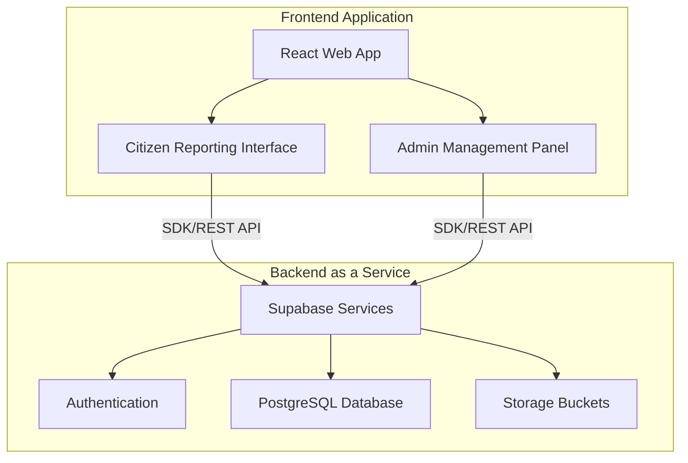

<h1 align="center">
  🌱 Guarden Environmental Reporting Platform
</h1>

  
  
  
  

A modern, responsive web application designed for communities to report environmental and city ordinance violations. The system provides an easy-to-use reporting interface with geolocation and image evidence for citizens, alongside a comprehensive management dashboard for administrators to track and resolve issues.

## 🚀 Key Achievements & Features

* **Interactive Geospatial Reporting:** Integrated `react-leaflet` to allow users to precisely pin and report environmental or city compliance violations using integrated geolocation.
* **Streamlined Evidence Collection:** Implemented secure image uploads and media handling capabilities to attach photographic evidence to community reports.
* **Real-Time Status Tracking:** Engineered a responsive dashboard for users to track the status of their reports in real time, enhancing community transparency.
* **Administrative Operations:** Developed a dedicated admin dashboard with filtering, management, and exporting tools (using `jspdf` and `html2canvas`) to orchestrate community responses effectively.
* **Modern Serverless Architecture:** Utilizes Supabase for a seamless backend-as-a-service, handling robust authentication, fully-typed PostgreSQL database tracking, and secure file storage without requiring a traditional backend server.

## 📐 System Architecture

The project relies on a React single-page application that communicates directly with Supabase services.

## 🛠️ Tech Stack

**Frontend:**
* **React 18:** Primary UI framework for building the single-page application.
* **TypeScript:** For strongly typed, reliable, and scalable and maintainable frontend code.
* **Tailwind CSS & Headless UI:** Utility-first styling framework and unstyled accessible UI components for building a modern aesthetic.
* **React Leaflet:** For rendering interactive maps and capturing accurate geolocation coordinates.
* **Framer Motion:** For fluid micro-animations and smooth component transitions.

**Backend (BaaS):**
* **Supabase:** The core backend replacing traditional server setups.
* **PostgreSQL:** Underlying relational database for persistent storage (Users, Profiles, Reports).
* **Supabase Auth:** Handling secure user sign-ups, logins, and administrative access control.
* **Supabase Storage:** For storing and serving user-uploaded report evidence imagery.

**Build & Tooling:**
* **Create React App:** Built via `react-scripts` for scaffolding and build toolchain.
* **Node.js & npm:** Package management and script execution.
* **PostCSS / Autoprefixer:** For parsing CSS and adding vendor prefixes.
